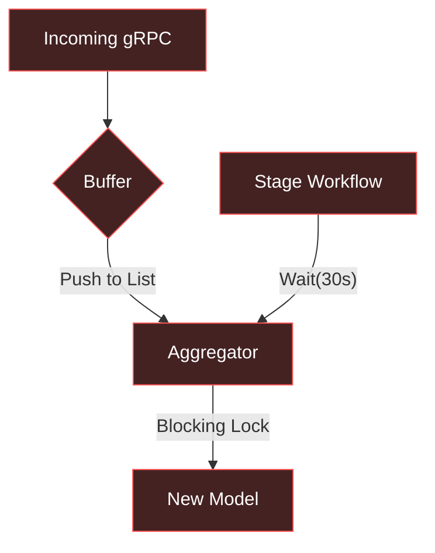
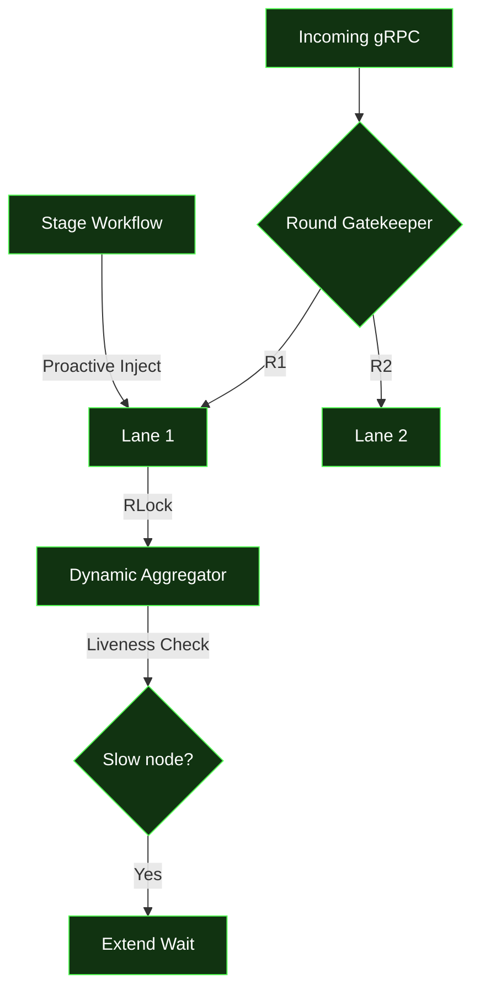
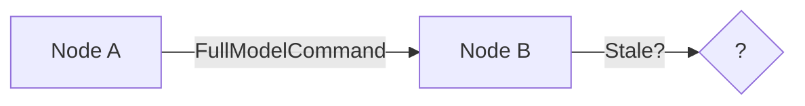
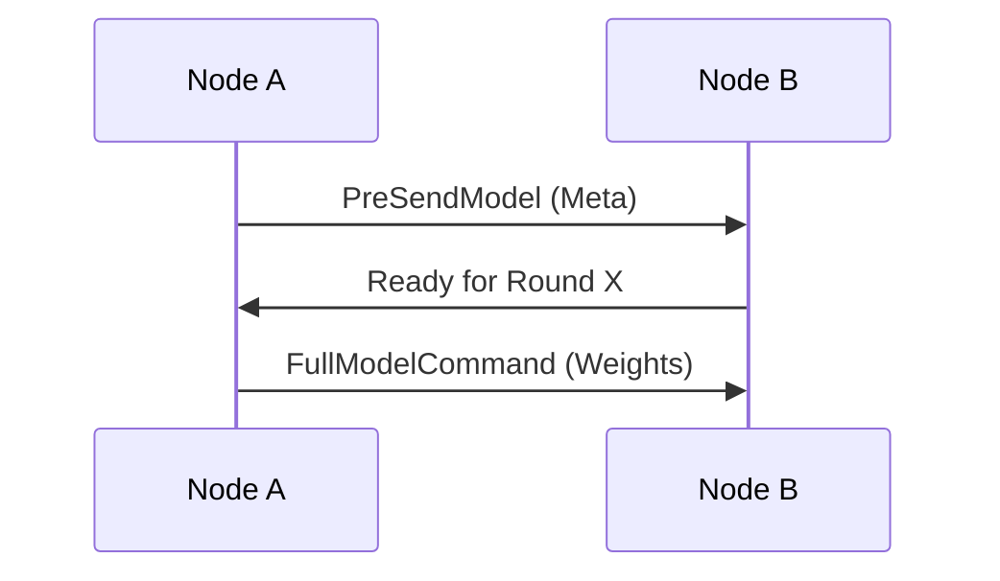
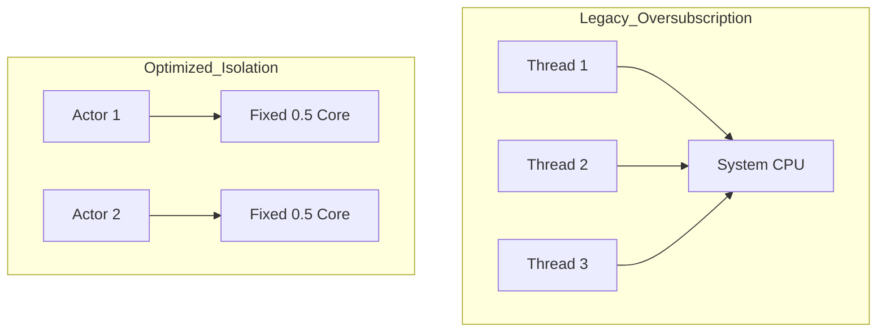

# P2PFL: Architectural Evolution
## Comprehensive Analysis: Legacy vs. Optimized Research Design

<div class="flex justify-center mt-8">
  <div class="px-6 py-4 bg-white/10 backdrop-blur-md rounded-xl border border-white/20 shadow-2xl">
    <div class="flex items-center gap-4">
      <div class="text-left">
        <div class="text-sm opacity-50 uppercase tracking-widest">Deep Dive</div>
        <div class="text-xl font-bold">Main vs. Research Branch</div>
      </div>
      <div class="h-10 w-px bg-white/20"></div>
      <carbon:chart-network class="text-4xl text-blue-400" />
    </div>
  </div>
</div>

---
layout: center
---

# The Scaling Challenge
### "From standard P2P to 128-core high-density simulation"

<div class="grid grid-cols-2 gap-10 mt-10">
  <div class="p-6 bg-red-900/20 border border-red-500/30 rounded-lg">
    <carbon:warning-alt class="text-3xl text-red-500 mb-2" />
    <h3 class="text-red-400 font-bold mb-2 text-lg text-left">Legacy Bottlenecks</h3>
    <p class="text-sm text-left opacity-80 italic">
      Static timeouts, non-reentrant locks, and a global singleton actor pool caused deadlocks and "stale data pollution" under heavy load.
    </p>
  </div>
  <div class="p-6 bg-green-900/20 border border-green-500/30 rounded-lg text-left">
    <carbon:checkmark-filled class="text-3xl text-green-500 mb-2" />
    <h3 class="text-green-400 font-bold mb-2 text-lg text-left">The Optimized Design</h3>
    <p class="text-sm opacity-80 italic">
      Round-aware buffering, Dynamic Patience, and dedicated resource isolation decouple node execution from global hardware jitter.
    </p>
  </div>
</div>

---
layout: side-by-side
---

# High-Level Flow: Legacy
### "The Single-Lane Approach"



- **Locking:** `threading.Lock` (Non-reentrant).
- **Buffer:** Unordered list (Round mismatch risk).
- **Wait:** Fixed timeout (No liveness check).

::right::

# High-Level Flow: Optimized
### "The Multi-Lane Highway"



- **Locking:** `threading.RLock` (Recursive safe).
- **Buffer:** `dict[RoundID, Models]` (Sorted).
- **Wait:** **Dynamic Patience** logic.

---

# Code Evolution: Concurrency & State
### Transforming the Aggregator Core

<div class="grid grid-cols-2 gap-4 mt-4 text-sm">

<div class="text-left">
<h3 class="text-red-400 mb-2">Legacy (main)</h3>

```python {3,4}
# p2pfl/learning/aggregators/aggregator.py
def __init__(self):
    self.__agg_lock = threading.Lock()
    self.__unhandled_models: list[P2PFLModel] = []
```
<div class="text-[10px] opacity-60 mt-2">
❌ Lock can deadlock in recursive callbacks.<br>
❌ List buffer mixes models from any round.
</div>
</div>

<div class="text-left">
<h3 class="text-green-400 mb-2">Optimized (research)</h3>

```python {3,4}
# p2pfl/learning/aggregators/aggregator.py
def __init__(self):
    self.__agg_lock = threading.RLock()
    self.__unhandled_models = defaultdict(list)
```
<div class="text-[10px] opacity-60 mt-2">
✅ RLock allows safe recursive state updates.<br>
✅ Dict-based round-aware buffering.
</div>
</div>

</div>

---

# Simulation Architecture: The Actor Pool
### From Singleton Bottleneck to Resource Isolation

<div class="grid grid-cols-2 gap-6 mt-4">
<div class="text-left text-sm">

### Legacy: Singleton `SuperActorPool`
- Uses `__new__` for Singleton pattern.
- **Dynamic Query:** Asks Ray for available GPUs.
- **Problem:** Cross-experiment interference.

```python
class SuperActorPool(ActorPool):
    _instance = None
    def __new__(cls, ...):
        if cls._instance is None:
            cls._instance = super().__new__(cls)
        return cls._instance
```
</div>
<div class="text-left text-sm">

### Optimized: Dedicated Instances
- Singleton pattern **Removed**.
- **Hardcoded Isolation:** Manual CPU (0.5) and GPU (0.01) fractions.
- **Safety:** Prevents oversubscription.

```python
# Optimized Resource Calculation
def _calculate_cpu_per_actor(self, num):
    # Fixed fractional allocation
    return 0.5 
```
</div>
</div>

---

# Protocol & Synchronization
### Metadata Handshaking vs Direct Transfer

<div class="grid grid-cols-2 gap-4">
<div class="text-sm">

### Legacy: Direct Transfer
- Nodes send weights immediately.
- Risk of receiving weights before the round is initialized.


</div>
<div class="text-sm">

### Optimized: Handshake First
- **`PreSendModelCommand`**: Handshake before weights.
- **`ModelInitializedCommand`**: Sync startup.


</div>
</div>

---

# Intelligent Synchronization
### "Dynamic Patience" vs Static Timeouts

<div class="grid grid-cols-2 gap-4">
<div class="text-left">
<h3 class="text-sm font-bold mb-2">Optimized Logic Snippet</h3>

```python {2-7}
# p2pfl/learning/aggregators/aggregator.py
for i in range(max_patience_rounds):
    # Check if missing nodes are still in our round
    still_active = check_liveness(missing)
    if still_active:
        logger.info("⏳ Extending wait...")
        self._event.wait(timeout // 2)
```
</div>
<div class="text-left">
<h3 class="text-sm font-bold mb-2">Engineering Outcome</h3>

- **Legacy:** Slow nodes were dropped immediately after 30s, leading to poor convergence.
- **Optimized:** If a peer is "active but slow" (still in the correct round), the system waits, maximizing data utility.
</div>
</div>

---
layout: default
---

# Hardware Resource Isolation
### Preventing CPU/GPU Contention in 128-Core Workstations

<div class="grid grid-cols-2 gap-8 mt-4">
<div class="bg-gray-800/50 p-4 rounded border border-gray-700">
<h3 class="flex items-center gap-2 mb-4 text-blue-400 font-bold"><carbon:chip /> CPU Pinning</h3>


</div>

<div class="bg-gray-800/50 p-4 rounded border border-gray-700">
<h3 class="flex items-center gap-2 mb-4 text-green-400 font-bold"><carbon:layers /> Software Stability</h3>

| Feature | Legacy | Optimized |
| :--- | :--- | :--- |
| **Framework Threads** | System Default | `torch.set_num_threads(1)` |
| **Job Management** | Direct Dispatch | `pending_submits` queue |
| **Model Safety** | Memory Only | **__local_model_backup** |
| **ID Logic** | Strict | **Address Normalization** |
</div>
</div>

---
layout: center
class: text-center
---

# Conclusion: The Engineering Leap

The transition from **Main** to the **Optimized Research** design represents a shift from 
"Functional P2P" to "Production-Grade Distributed Systems."

<div class="flex justify-center gap-10 mt-10">
  <div class="flex flex-col items-center">
    <carbon:locked class="text-4xl text-red-500" />
    <span class="text-xs font-bold mt-2">Rigid Locking</span>
  </div>
  <carbon:arrow-right class="text-4xl opacity-20" />
  <div class="flex flex-col items-center">
    <carbon:flow-connection class="text-4xl text-green-500" />
    <span class="text-xs font-bold mt-2">Round-Aware Flow</span>
  </div>
  <carbon:arrow-right class="text-4xl opacity-20" />
  <div class="flex flex-col items-center">
    <carbon:id-management class="text-4xl text-blue-500" />
    <span class="text-xs font-bold mt-2">Hardware Isolated</span>
  </div>
</div>

<div class="mt-12 text-sm opacity-50 italic">
Run with: <code>npx slidev presentation.md</code>
</div>
